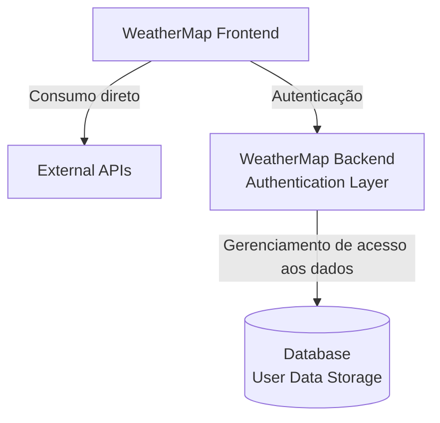

#####################################################################################
#
#                         MVP WeatherMap — Back-End
#                Pós-Graduação em Full Stack Development - PUC Rio - 2026
#                       
#                               Francisco Silveira
#
#####################################################################################

Este projeto faz parte do MVP da Sprint **Desenvolvimento Back-End Avançado**.

---

## Descrição
O **WeatherMap – Backend** é uma API desenvolvida em FastAPI, responsável pelo gerenciamento de usuários da aplicação WeatherMap.
Ela oferece endpoints para cadastro, autenticação e autorização, utilizando um sistema de tickets de acesso que permite ao frontend consumir rotas protegidas de forma segura.

As credenciais dos usuários são persistidas em um banco SQLite, com senhas armazenadas exclusivamente como hash bcrypt, garantindo segurança e integridade dos dados.
A API utiliza SQLAlchemy para modelagem e acesso ao banco, e organiza suas rotas e módulos de forma modular dentro da estrutura app/.

O backend é totalmente containerizado e executado via Docker, permitindo reprodutibilidade, isolamento e facilidade de implantação em qualquer ambiente.

---

## Como executar

O **WeatherMap – Backend** é executado exclusivamente via **Docker**, não sendo necessário instalar Python, FastAPI ou qualquer dependência local.

Certifique-se de ter o **Docker Desktop** instalado e funcionando em sua máquina.

---

### 1. Clonar o repositório

Antes de tudo, faça o clone do projeto:

git clone https://github.com/fcopobox/MVP3_FS_Back-End.git

---

### 2. Verificar instalação do Docker

Para confirmar que o Docker está instalado e ativo, execute no **PowerShell** ou **Command Prompt**:

-----------------------------------
`docker -v`
-----------------------------------

Caso o comando não retorne a versão instalada, instale o Docker Desktop antes de prosseguir.

---

### 3. Acessar o diretório do projeto

Após clonar o repositório, abra o **PowerShell** ou **Command Prompt** e navegue até o diretório raiz do backend (certifique-se do nome da pasta):

-----------------------------------
`cd MVP3_FS_Back-End`
-----------------------------------

---

### 4. Construir a imagem Docker

Execute o comando abaixo para construir a imagem do backend em modo de desenvolvimento (não esqueça o ponto no final do comando):

---------------------------------------
`docker build -t weathermap-backend .`
---------------------------------------

Este comando cria a imagem utilizando o Dockerfile presente no projeto.

---

### 5. Executar o container

Após a construção da imagem, execute o container:

-----------------------------------
`docker run -d -p 8000:8000 --name weathermap-backend weathermap-backend`
-----------------------------------

O backend estará disponível na porta **8000**.

---

### 6. Acessar a API

Com o container em execução, acesse a documentação interativa (Swagger) no navegador:

-----------------------------------
http://localhost:8000/docs
-----------------------------------

A partir desta interface, é possível testar todos os endpoints de cadastro, autenticação e autorização de usuários.

## Após os testes, para excluir o projeto:

### 7. Parar o container

Caso deseje interromper a execução do backend:

-----------------------------------
`docker stop weathermap-backend`
-----------------------------------

---

### 8. Remover o container

Após parar o container, você pode removê-lo:

-----------------------------------
`docker rm weathermap-backend`
-----------------------------------

---

### 9. Remover a imagem Docker

Para excluir a imagem criada:

-----------------------------------
`docker rmi weathermap-backend`
-----------------------------------

---

### 10. Verificar se foi removido

Para confirmar que o container e a imagem foram realmente apagados:

**Listar containers (inclusive parados):**
-----------------------------------
`docker ps -a`
-----------------------------------

**Listar imagens existentes:**
-----------------------------------
`docker images`
-----------------------------------

Se o container e a imagem não aparecerem na lista, a remoção foi concluída com sucesso.

---

### 11. Deletar a pasta onde o projeto foi clonado

Após remover o container e a imagem Docker, você pode excluir a pasta do projeto caso não deseje mantê-la no computador.

no Command Prompt:
-----------------------------------
`rmdir /s /q MVP3_FS_Back-End`
-----------------------------------

No PowerShell:
-----------------------------------
`Remove-Item -Recurse -Force MVP3_FS_Back-End`
-----------------------------------
---

### Observações importantes

- O banco de dados **SQLite** é criado automaticamente dentro da pasta `app/database/`.
- As senhas são armazenadas como **hash bcrypt**.
- O backend utiliza **tickets de autorização** para validar o acesso do frontend.
- Não é necessário instalar Python ou dependências locais — tudo roda dentro do container.

- A rota /admin/all é destinada exclusivamente a testes e inspeção do backend.
Ela retorna todos os usuários cadastrados no banco de dados, permitindo verificar rapidamente o funcionamento da API sem necessidade de autenticação ou envio de tokens.
Essa rota não é utilizada pelo frontend.

---
## Rotas

A API do WeatherMap – Backend oferece endpoints para cadastro, autenticação, atualização de dados, alteração de senha e exclusão de usuários.  

Acesse em: 
-----------------------------------
http://localhost:8000/docs
-----------------------------------

---

### Autenticação

**POST /user/register**  
Cria um novo usuário no sistema.  
A senha é armazenada como hash bcrypt.  
Retorna o usuário criado e um *access_token* para autenticação imediata.  
Aceita também requisições `OPTIONS` para preflight CORS.

**POST /user/login**  
Realiza o login do usuário.  
Valida email e senha (hash bcrypt) e retorna um *access_token* do tipo *bearer*, além dos dados básicos do usuário autenticado.

---

### Usuário (rotas protegidas por token)

**GET /user/{id}**  
Retorna os dados do usuário autenticado.  
Só permite acesso ao próprio usuário — tokens de terceiros são rejeitados.

**PUT /user/{id}**  
Atualiza nome e/ou email do usuário autenticado.  
Valida unicidade do email antes de salvar.  
Somente o próprio usuário pode alterar seus dados.

**PUT /user/{id}/change-password**  
Permite ao usuário alterar sua senha.  
Regras aplicadas:  
- senha atual deve estar correta  
- nova senha deve ter pelo menos 8 caracteres  
- nova senha não pode ser igual à anterior  
A senha é armazenada como hash bcrypt.

**DELETE /user/{id}**  
Exclui o usuário autenticado.  
Somente o próprio usuário pode realizar a exclusão.

---

### Administração (uso exclusivo para testes)

**GET /admin/all**  
Retorna todos os usuários cadastrados no banco de dados.  
Esta rota existe apenas para facilitar a verificação do funcionamento da API sem necessidade de autenticação ou envio de tokens.  
**Não é utilizada pelo frontend.**

---

### Observações

- Todas as rotas de usuário utilizam tokens gerados via JWT.  
- O banco SQLite é criado automaticamente em `app/database/`.  
- As senhas são armazenadas como hash bcrypt.  
- A rota `/admin/all` é apenas para inspeção e testes do backend.

---

## Estrutura do projeto

- `app/main.py`  
  Arquivo principal da aplicação FastAPI. Inicializa o servidor e registra as rotas.

- `app/routes/`  
  Contém todas as rotas da API (login, registro, atualização de dados, alteração de senha, exclusão e rota administrativa).

- `app/models.py`  
  Define o modelo `User` utilizado pelo SQLAlchemy para persistência no banco SQLite.

- `app/database/`  
  Diretório onde o banco SQLite (`weathermap.db`) é criado automaticamente.  
  Inclui a configuração da engine, sessão e criação das tabelas.

- `app/auth/jwt_handler.py`  
  Implementação da geração e validação de tokens JWT utilizados para autenticação e autorização.

- `app/auth/`  
  Módulos auxiliares relacionados à segurança, hashing e validação de tokens.

- `Dockerfile`  
  Arquivo responsável pela construção da imagem Docker em modo de desenvolvimento.

- `requirements.txt`  
  Lista de dependências Python utilizadas pelo backend.

---

## Tecnologias utilizadas

- **FastAPI**  
  Framework principal para criação da API.

- **Python 3.10+**  
  Linguagem utilizada no backend.

- **SQLite**  
  Banco de dados local, criado automaticamente dentro de `app/database/`.

- **SQLAlchemy**  
  ORM utilizado para modelagem, consultas e persistência de dados.

- **JWT (JSON Web Tokens)**  
  Sistema de autenticação baseado em tokens para rotas protegidas.

- **bcrypt**  
  Biblioteca utilizada para hashing seguro das senhas dos usuários.

- **Docker**  
  Execução isolada e reprodutível do backend em modo de desenvolvimento.

---
## Diagrama de Componentes da Solução

## Licença

Projeto acadêmico desenvolvido com fins educacionais para a Pós-Graduação em **Desenvolvimento Full Stack** da **PUC-Rio**.

---
